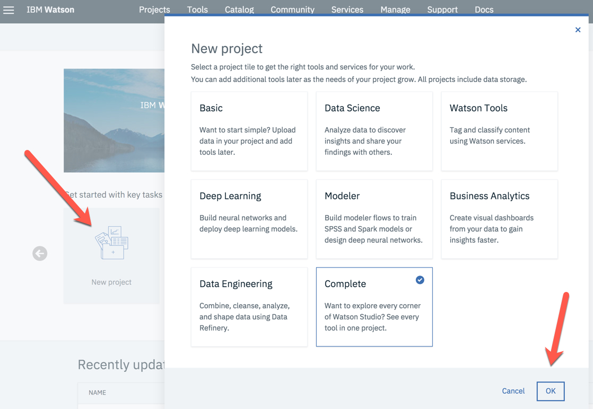
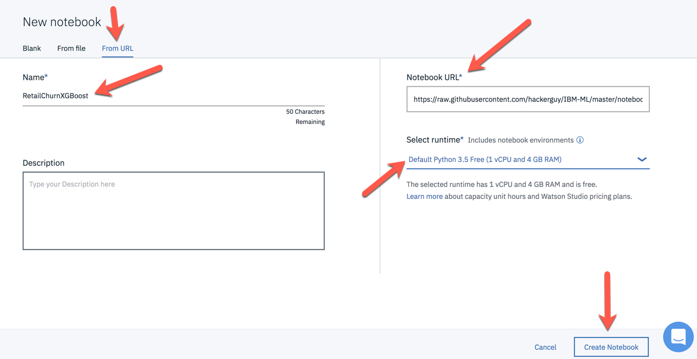

# MACHINE LEARNING ON IBM CLOUD


This repository contains a set of assets to demonstrate the development and deployment of a cognitive application on IBM Cloud. In this demonstration, you will build a machine learning model to predict the likelihood that a retail customer will churn, deploy a cognitive application that employs this model to score customers on their likelihood to churn, and store the scoring results in a database for further analysis.

The demo begins with ingesting two data sets - one with customer demographic information and the other with customer transaction history, joining, cleansing, and preparing the data for machine learning, training and evaluating a machine learning model to predict customer churn, and deploying the model as a REST API endpoint. An application is then deployed that hits this endpoint to score customers based on what was determined during model develpment to be the features with the highest predictive value. Results of each scoring request are then stored in a database for further analysis.

## <a name="toc"></a>Table of Contents

* [Overview](#overview)
* [Prerequisites](#prerequisites)
* [Instructions](#instructions)
	* [Build, save and deploy the machine learning model](#build)
	* [Provision cluster in IBM Cloud Kubernetes Service](#provision)
	* [Deploy PostgreSQL](#postgres)
	* [Deploy the application](#app)
	* [Score the model](#score)
	* [Investigate the scoring results written to the PostgreSQL database](#database)
* [Final Comments](#final)

## <a name="overview"></a>Overview


In this demo, you will use IBM Watson Studio to develop the retail churn machine learning model in a Jupyter notebook. The Jupyter notebook is written in Python and utilizes Pandas, scikit-learn and XGBoost to cleanse the data, transform it, and learn a machine learning model.


The data you will use to train a machine learning model resides in two files that can be found in the data folder of this repository. The Jupyter notebook will access these file directly from GitHub and use them to train a machine learning model.

* customer information (customer.csv)
* transaction history (transactions.csv)

Here is what the first four rows of the customer data set looks like. Notice the data anomolies. There is a text entry in the Frequency_score column, which is intended to contain only integer data. The Monetry_score column contains a value that is orders of magnitude bigger than what it should be. Monetary scores are supposed to range from 1 to 5.


Here is what the first four rows of the customer data set looks like. Notice the null values in the Retire column.


The data anomalies will be identified and removed in the Jupyter notebook as part of the data preparation steps in advance of training the machine learning model. Once cleaned, the data is transformed to prepare it for machine learning, and a machine learninig model is learned on the transfored data employing the XGBoost algorithm.

Here is a section of code from the notebook, which can be found in the notebooks folder of this repository.


IBM Watson Machine Learning (WML) is then used a repository for storing the model and deploying it as a publically accessibe REST API endpoint.

A Node.js web application used to score the model is containerized, deployed in Kubernetes on the IBM Cloud Kubernetes Service, and its URL made publically accessible so that it can be accessed in any brower over the internet. A PostgreSQL database is also deployed in the IBM Cloud Kubernetes Service. The Node.js application writes the scoring request and the predictions from the deployed machine learning model in WML into the database.


Upon scoring customers with the web application, the feature values scored along with the model prediction results, both the churn prediction as well as the probability of chrun are inserted into a PostgreSQL database table. The table columns correpond to the nine features used to train the model along with two additional columns for the prediction result and the probability.


## <a name="prerequisites"></a>Prerequisites

In order to execute the demonstration, whose assets are stored in this repository, you first need an IBM Cloud account and an IBM Watson Studio account. 

If you don't have these, you can go to the following links, click Sign Up, and follow the instructions to create an account.

* IBM Cloud account
	* <https://console.bluemix.net/>
* Watson Studio account
	* <https://dataplatform.cloud.ibm.com/>


## <a name="instructions"></a>Instructions

### <a name="build"></a>Build, save and deploy the machine learning model

In Watson Studio, create a project.



Then create a new Watson Machine Learning Lite service in the Settings tab for your project.


Create a notebook from the ipynb file included in the notebooks folder of this repository.
	
* From your Watson Studio project, create a new notebook using the option to create the notebook from URL
* Name the notebook 'RetailChurnXGBoost'
* Copy and paste this URL into Notebook URL

	```
	https://raw.githubusercontent.com/hackerguy/IBM-ML/master/notebooks/	RetailChurnXGBoost.ipynb
	```
	
* Select the 'Default Python 3.5 Free (1 vCPU and 4GB RAM) runtime, which is the free runtime.
* Click on Create Notebook




Insert the credentials for the WML service you just provisioned into the notebook. Find the cell in the notebook that looks like this and update the values for those of your WML service.


Run all cells in the notebook. You should ideally run the notebook cells one at a time and understand what is being done in each cell.

Idenfify these model life cycle task as you work through the notebook.

* Data ingestion
* Profile and clean the data
* Prepare data for machine elarning
* Split data into training and testing data sets
* Define a machine learning pipeline and train a model on it
* Evaluate the model
* Identify a best fit model and predictive importance of model features
* Save the desired model
* Deploy the model as a REST API endpoint
* Score the model with random data from the test data set

If you want to just run all the cells in the notebook, choose the Run All option under the Cell pull down menu. Make sure that every cell in the notebook completes successfully before moving on.


You should now have a model called 'XGBoost_model_for_Retail_Churn' listed in the Project section titled Watson Machine Learning models.

You should als have a deployment called 'XGBoost_model_for_Retail_Churn' in your project.

* Go to the Deployments tab in your Project
* Click one the Deployment Name 'XGBoost_model_for_Retail_Churn'
* Go to the Implementation tab

	

* Leave this browswer tab open, or copy and save the Scoring End-point, as you will need it later when deploying the cognitive app. Your Scoring End-point will look like this.

		https://us-south.ml.cloud.ibm.com/v3/wml_instances/d360e86c-6ddd-45f7-a908-d1ebf83a211d/deployments/bc639f91-8694-489b-8517-d7d3dcde368d/online
		
### <a name="provision"></a>Provision cluster in IBM Cloud Kubernetes Service

Download and install IBM Cloud CLI tools and the IBM Kubernetes Service plug-in.       
              
For Mac and Linux, run the following command:

	$ curl -sL https://ibm.biz/idt-installer | bash
	
For Windows 10 Pro, run the following command as an administrator:   
(Right-click the Windows PowerShell icon, and select Run as administrator.)

	C:\> Set-ExecutionPolicy Unrestricted; iex(New-Object Net.WebClient).DownloadString('http://ibm.biz/idt-win-installer')
	
Log in to your IBM Cloud account.
	
	$ ibmcloud login -a https://api.ng.bluemix.net
	
Create a free cluster.

	$ ibmcloud ks cluster-create --name IBM-ML
	
Check status of cluster. The state of the cluser will initially be 'requested'. The state will then change to 'deploying', then 'pending' and eventually to 'normal'.	

	$ ibmcloud ks clusters

***You can NOT proceed further with the lab until the cluster is created and the status show as 'normal'.***
	
Target the IBM Cloud Container Service region where the cluster was provisioned.

	$ ibmcloud cs region-set us-south	
	
Get the command to set the environment variable and download the Kubernetes configuration files.

	$ ibmcloud cs cluster-config IBM-ML
	
Set the KUBECONFIG environment variable. Copy the output from the previous command and paste it in your terminal. The command output should look similar to the following.

	$ export KUBECONFIG=/Users/richtarro/.bluemix/plugins/container-service/clusters/IBM-ML/kube-config-hou02-IBM-ML.yml
		
Verify that you can connect to your cluster by listing your worker nodes. As you  created a free cluster, you will only see one worker node.

	$ kubectl get nodes


### <a name="postgres"></a>Deploy PostgreSQL

Install helm as we will install postgresSQL using a Helm chart. Instructions for installing Helm can be found at <https://github.com/helm/helm>. Scroll down to the Install section and follow the directions for installing Helm.

Initialize the local CLI and also install Tiller into your Kubernetes cluster.

	$ helm init

```
$ helm install --name postgres-release --set postgresUser=user,postgresPassword=password,postgresDatabase=churndb,persistence.enabled=false stable/postgresql
```

Get your PostgreSQL user password

	$ PGPASSWORD=$(kubectl get secret --namespace default postgres-release-postgresql -o jsonpath="{.data.postgres-password}" | base64 --decode; echo)
	
Connect to your PostgreSQL database
	
	$ kubectl run --namespace default postgres-release-postgresql-client --restart=Never --rm --tty -i --image postgres --env "PGPASSWORD=$PGPASSWORD" --command -- psql -U user -h postgres-release-postgresql churndb
	
You will see the PostgreSQL interactive terminal (psql) prompt.

`If you don't see a command prompt, try pressing enter.`  
`churndb=#`

Create the table for storing the churn predictions by cutting and pasting the following table create statement into psql at the command prompt. Hit Enter if needed.

```
-- Table: public.churn

-- DROP TABLE public.churn;

CREATE TABLE public.churn
(
    retire integer,
    mortgage text COLLATE pg_catalog."default",
    loc text COLLATE pg_catalog."default",
    gender text COLLATE pg_catalog."default",
    children text COLLATE pg_catalog."default",
    working text COLLATE pg_catalog."default",
    highmonval text COLLATE pg_catalog."default",
    agerange text COLLATE pg_catalog."default",
    frequency_score integer,
    prediction integer,
    probability double precision
)
WITH (
    OIDS = FALSE
)
TABLESPACE pg_default;

ALTER TABLE public.churn
    OWNER to postgres;
    
```

The exectution of the SQL statement should return this.

	ALTER TABLE

Show a summary of the table just created. You are only typing in '\d+ churn', 'churndb=#' is the psql command prompt.

	churndb=# \d+ churn
	
You should see output that looks like this. Notice the column names and data types that correspond to the data types used in the machine learning model.

```
     Column      |       Type       | Collation | Nullable | Default | Storage  | Stats target | Description 
-----------------+------------------+-----------+----------+---------+----------+--------------+-------------
 retire          | integer          |           |          |         | plain    |              | 
 mortgage        | text             |           |          |         | extended |              | 
 loc             | text             |           |          |         | extended |              | 
 gender          | text             |           |          |         | extended |              | 
 children        | text             |           |          |         | extended |              | 
 working         | text             |           |          |         | extended |              | 
 highmonval      | text             |           |          |         | extended |              | 
 agerange        | text             |           |          |         | extended |              | 
 frequency_score | integer          |           |          |         | plain    |              | 
 prediction      | integer          |           |          |         | plain    |              | 
 probability     | double precision |           |          |         | plain    |              | 

```

Exit from psql by typing '\q' at the psql prompt.

	churndb-# \q
	
***Only exit from psql. Do NOT close the terminal.***
	
### <a name="app"></a>Deploy the application

#### Get the application code

Clone the source code for the application.

	$ git clone https://github.com/hackerguy/IBM-ML.git

Change directory.

	$ cd IBM-ML/app
	

#### Upload code to the IBM Cloud Container Registry
	
Log in to the IBM Cloud Container Registry CLI.
	
	$ ibmcloud cr login
	
You must set at least one namespace before you can push a Docker image to IBM Cloud Container Registry.

	$ ibmcloud cr namespace-add ibm-ml
	
Build the app as a Docker image in IBM Cloud Container Registry.
	
	$ ibmcloud cr build -t registry.ng.bluemix.net/ibm-ml/ibm-ml:1.0 .
	
#### Create the Kubernetes secrets

First you need to get the credential for your Watson Machine Learning service.

* Target the Cloud Foundry environment on IBM Cloud. Choose the Cloud Foundry space with you Watson Machine Learning service

		$ ibmcloud target —cf
		
* Get a list of services in the space
	
		$ ibmcloud cf services
		
* Get a list of service keys for your service using the name of your service for the list.

		$ ibmcloud cf service-keys ‘Your Watson Machine Learning Service Name’
		
* Get the credentials using the service and service key name from the list.

		$ ibmcloud cf service-key ‘Your Watson Machine Learning Service Name' ’Service Key Name’

Create the secret for WML. Replace wml_username and wml_password values with the credentials from your WML service that you just found.
	
`$ kubectl create secret generic wml-secret --from-literal=wml_username='4be82790-d71b-4c9f-ac4e-5af3c4b9c9b1' --from-literal=wml_password='47571902-8632-47e8-9590-323f49975136'`

Create the secret for PostgreSQL.

	$ kubectl create secret generic pg-secret --from-literal=pg_user='user' --from-literal=pg_password='password'
	
#### Create a Kubernetes ConfigMap

Create a ConfigMap for the scoring end-point. Replace scoring_endpoint with the value from your deployment.

	$ kubectl create configmap scoring-endpoint --from-literal=scoring_endpoint='https://us-south.ml.cloud.ibm.com/v3/wml_instances/d360e86c-6ddd-45f7-a908-d1ebf83a211d/deployments/bc639f91-8694-489b-8517-d7d3dcde368d/online'
	
#### Deploy the Docker image to Kubernetes

	$ kubectl create -f ../yaml/ibm-ml-deployment.yaml
	
#### Create a Kubernetes service

	$ kubectl expose deployment/ibm-ml-deployment --type=NodePort --port=3000 --name=ibm-ml-service
	
#### Display the service details

	$ kubectl describe service ibm-ml-service

The output should look like this.

```
Name:                     ibm-ml-service
Namespace:                default
Labels:                   run=ibm-ml-deployment
Annotations:              <none>
Selector:                 run=ibm-ml-deployment
Type:                     NodePort
IP:                       172.21.189.104
Port:                     <unset>  3000/TCP
TargetPort:               3000/TCP
NodePort:                 <unset>  32482/TCP
Endpoints:                172.30.206.75:3000
Session Affinity:         None
External Traffic Policy:  Cluster
Events:                   <none>
```

Find the NodePort. The NodePort you would want from the service description above is '32482'.

Get the IP address of the Kubernetes cluster worker node where the application is running. Again, as this is a free cluster, there is only one worker node.

	$ ibmcloud ks workers --cluster IBM-ML
	
```
ID                                                 Public IP         Private IP      Machine Type   State    Status   Zone    Version   
kube-hou02-pa551ca23425854181a04a73c495951366-w1   184.172.234.202   10.76.154.165   free           normal   Ready    hou02   1.10.5_1517
```
Find the Public IP. The Public IP you would want from output above would be '184.172.234.202'.

### <a name="score"></a>Score the model

In a web browser, go to https://Public IP:NodePort. For example, <http://184.172.234.202:32482>.

***This URL will not work for you. Make sure to replace the Public IP and the Node Port with the values associated with your Kubernetes cluster and service deployment that you found above.***

The Node.js web application should look like this.


Change any of the radio button inputs, representing the features on which the machine learning model was trained, to rescore the model and display the prediction associated with the set of input features.

The application is designed to rescore the machine learning model and update the prediction EVERY time an input feature is changed using the radio buttons. Each time an input feature is changed, the values of the input features and the churn prediction are written to the PostgreSQL database table as a new row.

Let now take a look at the data you've written to the database.

### <a name="database"></a>Investigate the scoring results written to the PostgreSQL database

Go back to PostgreSQL interactive terminal.

	$ kubectl run --namespace default postgres-release-postgresql-client --restart=Never --rm --tty -i --image postgres --env "PGPASSWORD=$PGPASSWORD" --command -- psql -U user -h postgres-release-postgresql churndb

You should be at the psql prompt that looks like this.

	churndb=#

Run the following SQL query to show all rows in the table. As before, 'churndb=# is the psql command prompt. You don't type that.

	churndb=# select * from public.churn;
	
You should see results that look like this.

```
 retire | mortgage | loc | gender | children | working | highmonval | agerange | frequency_score | prediction | probability 
--------+----------+-----+--------+----------+---------+------------+----------+-----------------+------------+-------------
      1 | Yes      | Yes | Male   | Yes      | Yes     | Yes        | 17 to 22 |               1 |          1 |     0.32192
(1 row)

```
Change another radio input in the web app, rerun the SQL query, and notice how each time you change a radio button, a new row is added to the database table.

```
 retire | mortgage | loc | gender | children | working | highmonval | agerange | frequency_score | prediction | probability 
--------+----------+-----+--------+----------+---------+------------+----------+-----------------+------------+-------------
      1 | Yes      | Yes | Male   | Yes      | Yes     | Yes        | 17 to 22 |               1 |          1 |     0.32192
      1 | Yes      | Yes | Male   | Yes      | Yes     | Yes        | 60 to 70 |               1 |          1 |     0.17499
(2 rows)
```

When you are done querying the churn results table, exit from psql and delete the associated PostgreSQL client pod it is running in by typing '\q' at the psql prompt.

	churndb-# \q

## <a name="final"></a>Final Comments

In this demo, you've worked through an entire machine learning model life cyle - from data to deployment of a cognitive application that employs the model you created.

The deployed app and associated PostgreSQL database can also be used to demonstrate the end result of the machine learning workflow run through in this demonstration (without having to deploy the app and database again).

The free IBM Cloud Kubernetes cluster used in this demonstration expires in a month from the time of creation of the cluster. During this month, the application and database will remain running. You can visit the web page, for example, <http://184.172.234.202:32482> replaced with the IP address of the worker node of your cluster and the NodePort of the service you exposed, from any browser to bring up the app.

Go back to PostgreSQL interactive terminal to investigate the stored results in psql.

	$ kubectl run --namespace default postgres-release-postgresql-client --restart=Never --rm --tty -i --image postgres --env "PGPASSWORD=$PGPASSWORD" --command -- psql -U user -h postgres-release-postgresql churndb
	
Remember to close the PostgreSQL pod when finished.

	churndb-# \q


I hope you found this exercise beneficial. 

[Back to Table of Contents](#toc)


 